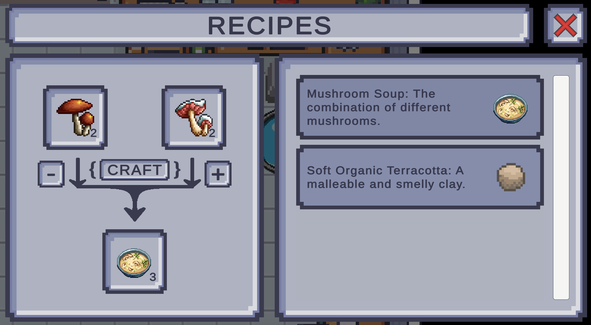
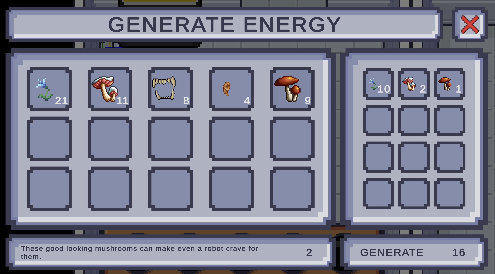
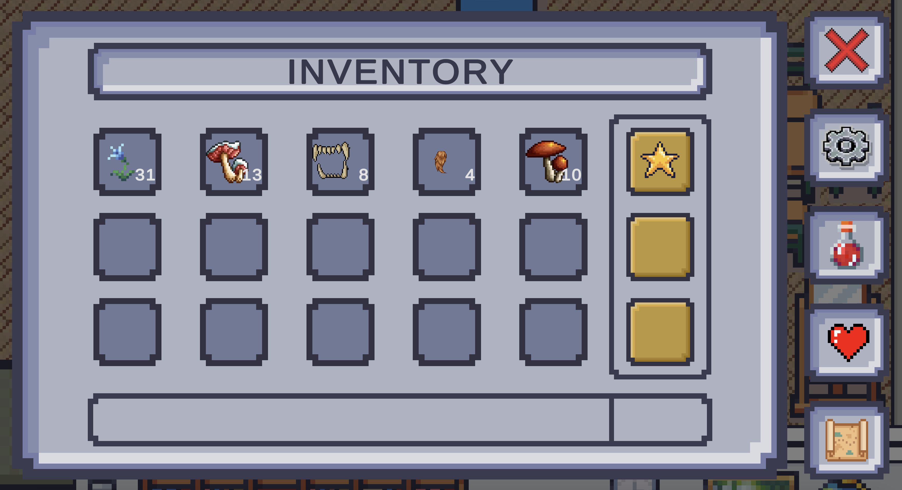
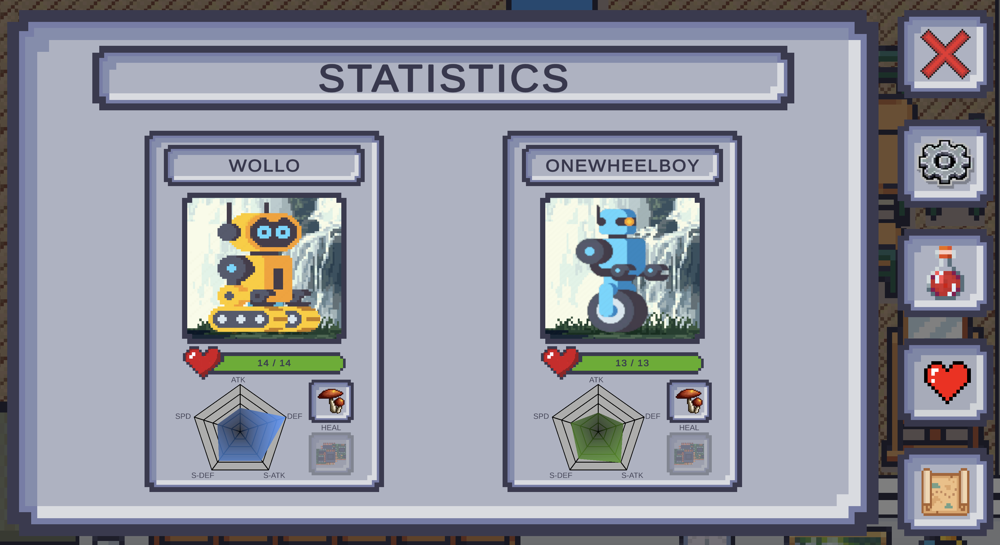
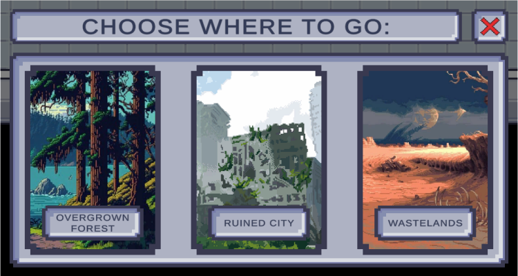
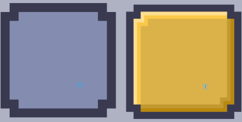
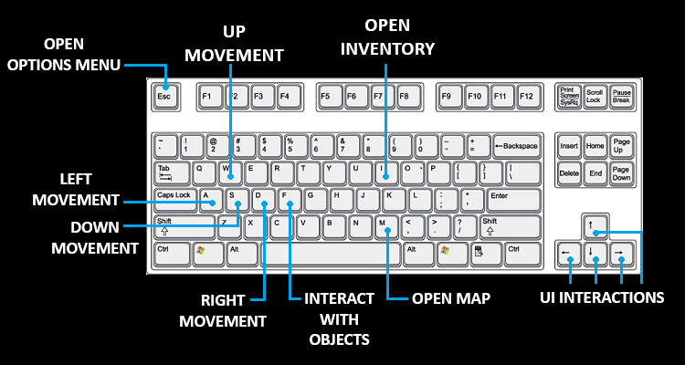

# RECLAIM;HUMANITY  

### Game Design Document V1.1

- # OVERVIEW
    RECLAIM;HUMANITY is a top down 2D RPG game in pixel art, where gamers will play as Wollo, a cute little robot, who has to overcome the most difficult mission he has ever accomplished: *save the whole humainty!*
    ___
    ___

- # GAMEPLAY: An Exploration Adventure
    Humans has been affected by a terrible virus, which has paralyzed all of them. Your mission is to find the cure against this virus. Here are listed the main mechanics that the player will use to fulfill the task:

    - **EXPLORATION**: go around the world, search in every corner and find all the things you need to go on on your adventure, may these be items to generate energy or some knowledge about recipes you heard about a long time ago;
    
    - **INTERACTIONS**: Whenever you find a human use your main tool, the **TRANCESMITTER**, to speak to them. This will help you unlock more recipes which will lead, at the end, to the final cure;

    - **CRAFTING** is not easy, you must first find the correct **RECIPE** that generates that **ITEM** and second find all the ingredients you'll need for it. You will find items laying all around the map, but sometimes it will not be so easy and you'll have to fight to obtain them;

    - **COMBAT**: may it be that you need some items for your new recipes or that you need access to some mysterious place, sometimes combat will be necessary to advance in the adventure. Just pay attention not to die, otherwise who will save humanity? Combat will be TURN-BASED, most similar to a pokemon style, where Wollo will face enemies one action at a time;

    - **LEVELLING**: There won't be a player level to carry on, but a "Laboratory" one, in form of **ENERGY** accumulated in the Lab. Every time you find yourself with an inventory full of useless items don't just drop them! Use those to generate energy in the laboratory in order to unlock **POWER-UPS**, new **WEAPONS** and many other things. Moreover recipes will need a certain amount of energy to be completed (they won't consume it though) so be careful to this aspect of the game too;

    ___
    ___

- # CHARACTERS
    - MAIN CHARACTER: you will play as **Wollo**, a lonely robot who whishes to wake up his master. He (you) has the possibility of saving humanity by starting a trip that will lead him to some rare and special items. However he doesn't know the recipe of the drug that can awake people, but there must be someone who knows it! In order to find it, he will use the TranceSmitter, his master's invention, to connect to paralyzed humans and read their minds hoping to find the recipe he needs.
    - HUMANS: They will be all around the world, unfortunately paralyzed. Nevertheless, thanks to the TranceSmitter in your possession, you can interact with them and they will contribute to your adventure as they can. Since one of them knows the final recipe, you are encouraged to talk to as many humans you find while exploring the desolate lands.
    - ENEMIES: There will be enemies scattered everywhere, so pay attention to where you go. Try not to face powerful creatures if you are not preapered to. [v2.0] Each biome has a specific type of enemy, which has its own specific behaviour. Enemies' drops will be very useful, since it's necessary to craft items and to level up the lab. [v1.0] Technically speaking we can add as many enemies as we want / have time to, but for starters one typology for each biome I think will be enough. These first enemies' drops will be used in recipes too, while possible future enemies will just have their drops used to generate energy in the lab.
    - DR.IDK: your creator, as all other humans, has been affected by the virus and now stands still in his room in the laboratory. When you'll finally complete your mission and have the cure, use it to awaken him and complete the game;
    - COMPANIONS: Along the way you may find companions (2 MAX) which will travel with you. They will be more than happy to help you, but they're shy and will come out only when you need the most: during fights;

___
___

- # GAME STORY
- Past Events:
    A sight of the world 100 years before: humanity has rised to the top of civilization: people have found a solution for climate change, they now use only energy from renewable sources and they have solved world' hunger and wars problem. There is just a little extra thing that humans still don't have that will make them the perfect species: immortality. But how to accomplish that? All most famous biologists and doctors of the world have come together to make that a reality and are now working on this special virus that could be the final solution. They are really really close, but the current virus has a just little problem since it gives immortality, but it also paralyzes the victim. And, just like in the worse horror films, this virus manages to find a way to spread outside the lab it was contained in and, as we know, affect whole humanity. Wollo, which is immune (obv) to its effect, carries on his life like nothing has happened, but day by day he feels more and more lonely, but he can't do anything since he doesn't know nothing about medicine. Until one day, now, 100 years later, he discovers in the lab the TranceSmitter and now has a way to learn about the world by getting in touch with humans. It begins then our adventure to save everyone;

- Our time: here is described how the game should be carried out, obv each player will interact with it as he pleases.
The game starts in the laboratory where Wollo has just discovered the Trancesmitter (It would be nice to have a short video about this, but it's probably too much work to do), and he's talking to Dr.IDK about the game mission. Once finished it can start explore the laboratory. In it he will find some basic tutorial on how to make recipes and energy for the lab, as well as how to find items and recipes around the world. Once the laboratory has been investigated Wollo will be able to use the teletrasport at the entrance of the laboratory and go in the first biome which is the Forest. The other 2 biomes will be blocked since they are unlockable by reaching a certain amount of energy in the laboratory. In the forest, but the same applies for the other biomes, Wollo will look around the map searching basically for 3 + 1 things:
    1. Humans: which he can interact with in order to learn new recipes or other details about the surrounding environment;
    2. Collectible Items laying on the map floor: these items are necessary for recipes and energy so he must collect a bunch of them (for example in the forest there will be mushrooms);
    3. Enemies spawning in certain areas: these are similar to collectible items in the sense that when defeated they drop some items necessary for recipes. The difference is, obviously, you have to combat them to gain the goods;
    4. "BONUS": at the end of each biome a legendary item will be found. This is quite important since the combination of the three, still with other things, is a key element for creating the final cure. Those items are uniqe, once found they will not spawn anymore anywhere, but they cannot be dropped nor use for energy and they will remain in the inventory until they will be needed for the final cure' creation. In the inventory there is a special place for those;
Once one biome has been explored the player can go back to the lab and use items and recipes found there to advance in the game mission. A visited biome can be visited again to collect other of those items if needed. Once all the items has been collected and all recipes found it will be time to be back in the lab and craft the cure. Once this is also done the last thing to do will be to use the cure on Dr.IDK to save him. In that moment (beside maybe a little thanks dialogue) the game will be finished.

__
__

- # THE WORLD
    - The main location will be the **laboratory** where the player may generate energy for unlocking new things and craft recipes with items found.
    - The explorable world will feature 3 biomes: Overgrown Forest, Ruined City and Wastelands. Wollo will have to explore each one of them to find unique items and enemies that will help him finishing his mission. Possibly each biome will have a single unique item that will be found at the end of the biome exploration and that is necessary to make some specific recipe.

    MUCH IMPORTANT, each biome will contain one special unique item "hidden" somewhere in the biomes. Those items will be needed to complete the final recipe, not as ingredients, but as external components, below they are shown in each category.
    - LABORATORY:
        - Doesn't include any enemies or collectible items, but it's the place where all main activity inherent to the completion of the mission will be carried out, including the generation of energy for the laboratory, the crafting of found recipes and the teletrasportation to all other biomes.
    - OVERGROWN FOREST:
        - Collectible Items:
            - Mushrooms: they will be of 2 types, some good and some bad. Player will only recognize bad from good mushrooms if he speaks with one of the humans he will find in the forest. Still bad mushrooms will be useful for energy;
            - Wolves Fur and Fangs: will be collected once the player has beaten the pack of wolves that will spawn in some specific areas of the forest;
        - Enemies:
            - Pack of Wolves: in certain area, randomly for what concerns specific position and number of wolves, a pack will be spawned and sill follow the player across the map until the player doesn't fight them. The combat against them will start as soon as one of the wolves has touched Wollo. Players will be encouraged in fighting them since they will drop collectible once defeated. Wolves are pretty weak alone against a robot, but they will stand a chance if they'll combat all togheter;
        - SPECIAL FOREST ITEM:
            - Long time ago, but still after the human society collapse, a star managed to fall into the forest and there still it is, waiting for someone to find her. This star contains some elements that are really rare to find normally on Earth. The star will be used as catalyst in the final reaction;

    - RUINED CITY:
        - Collectible Items:
            - Coins: coins will be found everywhere, but we won't need them to buy something (just because society is dead). We will use them as metal scraps from which get some specific chemical reactions, maybe as catalyst (for example from a already made substance from another recipe we will need the metal to complete the reaction);
            - Lubricant Oil (and possibly electronic scraps): These items will be dropped once defeated a Rogue Robot. Lubricant oil will used in recipes while, but is still an idea, electronic scraps could be needed by Wollo to gain beack health after a fight. If not they will be used somehow in recipes or be dropped and not appear in the final game;
        - Enemies:
            - Rogue Robots: once used to do houseworks while humans could live their lives, now this robot are gone crazy and roam the city attacking everything that moves. If players eneter in their laser field of view they will automatically shot lasers at you and the combat will start. Rogue Robots will generally combat alone, and they are enought tough to teach the player a lesson, but if the player manages to trigger two or more combatments simoultaneously then the combat will be carried out with Wollo facing all enemies triggered;
        - SPECIAL CITY ITEM:
            - In the city used to stand a big temple, now fallen down. In it people used to pray a small relics with the shape of a God. Wollo is a robot and is not coded to believe in what it can't comprehend, but he knsow the statue is made with a rare material that emits certain waves that are necessary to make the final potion as it should be. So it will not be used as ingredient, but put on the side to channel those waves to the potion;
    - WASTELANDS:
        - Collectible Items:
            - Nuclear Scraps: nuclear scraps are so radioactive they would mutate, or even kill istantly, any living creature (that is not immortal, like humans around them...), but they are just harmless to a robot so technologically advanced. Nuclear scraps will be needed to create the potion since immortal humans can "digest" them too;
            - Adenithyst: special mineral foundable only in these wastelands, generated by the combination of iron, sand, uranium mixed in really high temperatures. Wollo will need this item as pure ingredient of its potions;
        - Enemies:
            - Animal Mutants: they roam the wastelands, searching for the smallest piece of food they know they will not find. Since the player goes around carrying potions and mushrooms, that have a really good smell, mutants will be attracted to Wollo and will try to attack him. Technically speaking it differs from the wolves because wolves will be prompt to follow the player once this gets close enough to them, otherwise they will just don't care; Mutants, on the other hand, will attack the human as soon as they see him, so the range of collision will be much higher;
        - SPECIAL WASTELANDS ITEM:
            - These wastelands were the result of a tremendous nuclear explosion happened since the nuclear power plant, whithout humans, didn't have the required maintenance and went blowing up. Now nuclear scraps can be found all around it, but if someone manages to find his way inside the (once) power plant he will find that one nuclear reactor is still in good shape (how? I don't know, magic maybe). This reactor is the last component necessary to make the cure, and will be the container in which Wollo'll make it.

    - &rarr; Just to note, once all 3 special components will be found they will be carried to the laboratory where a special UI will be presented with 3 slots. Putting the 3 components inside the slots, and pressing the button below, will create a single machinery, which will not be possible to put in the inventory but will be "spawned" autromatically inside the laboratory. When Wollo will put all necessary potions/materials inside it the process of creating the final cure will start and in a couple of seconds, it will be possible to take the cure item and finish the game;

___
___

# MEDIA LIST
- Sprites used as tilesets and items sprites have been found on Itch.io and here is a list:
## SPRITES
* Sprites used as tilesets and items sprites have been found on Itch.io and here is a list:
    - LimeZu: "Modern Interiors", "Modern Exteriors";
    - ELVGames: "Rogue Adventure World!";
* Characters and enemies (with thier relative animations) _have been created specifically_ using a graphic program that 
  can manage pixel art.
## MUSIC
- Music in background are a selection of tracks from videogames "Days Gone", "The last of us 2" and "Microsof Flight 
  Simulator";
- Sound effects are downloaded from https://www.zapsplat.com/ or from https://pixabay.com/sound-effects/ and they are all free license.
___
___

# OTHER DETAILS:

- ## SCENES DETAILS:
    - LABORATORY:
        - **Energy Circles Status**: 5 circles are used to show the energy the lab has. The energy value is saved in a scriptable object called "LabEnergySO" which is under the "Scriptable Objects/General" folder. Every circle contains 100 energy points, and it is animated to change when the energy reaches 0/25/50/75/100 % of the circle. The animations for the 25/50/75 % are composed by 4 frames arranged in the Animation section, the animations for Full and Empty state are single sprites used as animation. I used for all an animation so that I could easily manage them in the Animator. In it I used a "AnimationToPlay" parameter to make the initial dispatcher (which has no animation) choose the right animation. Since energy can change when player is whithin the laboratory scene I put the parameter setter inside the Update function so that it is rightfully changed when needed. Last detail, there is a canvas near the energy circles which is not enabled until the player get close enough. This canvas shows the right amount of energy with a number which goes from 0 to 500.

        - **Recipe Inventory Show**: in the lab, in the Laboratory scene, there is a platform that is animated to 
          attract the player. This platform is where the player has to go to complete recipes. When the player 
          stands on top of it an "animated" sprite show us to click the "F" button on the keyboard. If clicked the 
          canvas with the recipes and it shows up and let the player see what recipes are already unlocked and which 
          one are not, let the player get items from its inventory and let him crafts those recipes.
        - **Restore energy point**: in the bedroom (near the bed) there is a special interaction that can restore all 
          the healthy points (HP) of the main character

        - Everything else it's in the Laboratory scene is there just as furniture, nothing else does something special;

- ## DETAILS ABOUT PROJECT ORGANIZATION:
- Inside the project we can found many folders that are not managed directly by Unity:
    - Documents: contains this file, the GDD, and a folder containing all images used in this file;
    - Executables: the final exe files for running the game;
    - Gameplay Video: trivial;
    - Images: some images of gameplay; Both Gameplay Video and Images contents will be used (I think) in the Itch.io page of the game to show people how the game is;
- Inside the project there is the most important folder, the Assets one. Inside we can find:
    - Animations: contains sprite sheets for special animations that can be find in the world;
    - Art: contains every sprite sheet, tileset, tilemap that the game includes. Contains also smaller animations that are not so important;
    - Audio Files: contains background musics;
    - Editor: contains the transversal variables of the game;
    - Fonts: the fonts which are used;
    - Images: images used in UI, such the one of the menu;
    - InputActions: contains the files created from the InputActions package. Used to divide this particular files from the scripts;
    - Materials: has material for physical objects;
    - JsonFiles: contains all JSONs used for saves, dialogues and fixed properties of the game;
    - Mixers: contains the audio mixers;
    - Plugins: has the extra plug-ins used;
    - Prefabs: contains all prefabs created;
    - Resources: contains the resources for power-ups of the creatures in the games;
    - Scenes: divided into World scenes and UI scenes, contains every scene used fot the game;
    - ScriptableObjects: contains all instances of scriptable objects used in the game;
    - Scripts: all C# scripts are stored inside here, divided based on their behaviour and what GameObjects / Scenes they affect;
    - Sounds: contains files for sound effects;
    - TextMeshPro: contains files related to the TextMeshPro package used for the UIs;
    - URP: contains assets file that make the game use the URP render pipeline;

- ## TECHNICAL DETAILS IMPLEMENTED:
    - Here are reported all technical details of the game:

    - **GENERAL DETAILS**:
        - _MAIN CHARACTER_: The main character is controlled by the player and is used to go around the game world. For a specific description of all its components see the Prefabs section below here;

        - _GRID AND TILEMAP_: All scenes use grids to draw the map of their biome; this grids are composed by 
          different tilemaps so that it is possible to have different behaviour with each one. To obtain the desired render results we used the property "Order in layer" inside the Tilemap Renderer component of each tilemap.Tilemaps are described below in order from the lowest order one to the highest rendered:
            - BGBehind: a rectangular area all Black, used as "Out of the map" view.

            - Background: contains the drawings of the shape of the map with all the different pavements used. For example the Overgrown Forest uses this layer to draw the grass growing on, basically, all the map;
            
            - DetailsLayerK: those are a N amount of different layers used for detailing all the background. We use more than one since if a detail must stand over another detail we need multiple layers. An example is when the background layer draws the path where the player will walk, the first layer contains the details of the side of the path, the second contains high grass and little rocks and the third one is used to put moss on those rocks;

            - AbvBehCollisionObjs: althought the name might frighten, it is the abbreviation of Above Behind Collision Objects. The name specifies how we used the URP property "Transparency Sort Mode" to make the drawings of this layer have a dynamic behaviour, in order to obtain a double effect that resembles reality. Comparing the Y coordinates of both player and objects, if the player stand lower than objects than it renders ABOVE, on the opposite if he's higher then he renders BEHIND. To stop the player from going through the objects we use tilemap colliders 2D on objects inside this layer and, to enhance performcances, we use a composite collider 2D;

            - OverPlayerObjs: Objects that are ALWAYS above the player, like a roof of a house;

        Order of this tilemaps starts from negative number and goes up 2 by 2, to allow the insertion of another tilemap if needed without changing all the others. AbvBehCollisionObjs tilemap has the same order in layer of the main character which is 0;

    - **GRAPHICS**:
        - The game uses the URP rendering pipeline of Unity; in this the only property changed is the "Transparency Sort Mode" which is set to "Custom Axis" and the "Transparency Sort Axis" that follows is put to (0, 1, 0). With this the main axis is the Y one and rendering of objects will be computed based on their Y position. Be aware that ALL sprites that follow this rule have their pivot not in their center but moved down more or less where it would be the center of the area the sprite would stand over if it was a 3D obkect;

        - All sprites and tilesets use a Pixel Per Unit of 32, since most of them are made of 32x32 pixels. Some of them are made by 48x48 pixels, but since it is a better quality shrinked then the difference isn't spottable. Being in pixel art ALL sprites, multiple and single, have property "Filter Mode" to "Point (no filter)" and "Compression" to "None";

        - Screen resolution is 16:9, no change and resize possible for now;

    - **SPRITES**:
        - Sprites are graphic element of the biome / scene that are not drawn using tilemaps. Generally these are details that make the scene look better, like all the furniture in the laboratory, or that are particulary useful to player, like machinery or collectible items around the worlds;
        In each scene we use some empty game objects to organize all sprites present in the scene. Sprites are 
          divided by the place they are put into;

        - Sprites have different pixel dimensions and generally are manually sliced from the sprite sheet they are taken from. Anyway all of them gameobjects have a certain position, sprite and order in layer to obtain the desired renderization and behaviour. Many of them have a Box Collider 2D so that the player cannot pass through them, such as trees or furniture. Some of them have even some script behaviour, like the battery we find in the laboratory that has attached a TextMeshPro component and a script that takes the energy of the lab from a scriptable object and shows it on the text, or the energy spheres that show, without a number, again the amount of energy contained in the lab;

    - **AUDIO MIXER**: [v. 2.0] The Audio Mixer of the video-game has 3 different channels:
      - _Master_: The principal channel, lowing down or increasing its level, has consequences on the volume of 
        the child channels.
      - _Music_: The channel for background music. Audio Source with audio files for background outputs the signal 
        to this channel.
      - _SoundFX_: Output channel for sound effect music.  Every sound effect is reproduced instantiating a new 
        game object and then destroying it.
    
      The volume of all these channel is settable in the option UI panel.
      
      [v. 1.0] Every sound effect is reproduced using function "PlayClipAtPoint" and background music just with an 
        audio source

    - **UI ELEMENTS**: Note of a general detail, all UI elements that can appear while the player gameobject is istanciated have the property to block the player while they are opened, they do this by setting the player speed in the main character PlayerMovement script component to 0; once they get disabled they put the velocity back to the "Normal Speed" variable contained in the player script.

        - _LABORATORY_:
            - Recipe UI: Recipe UI contains everything needed for creating recipes, from the slots used to contain items to the panel showing the player inventory so that he can take what ingredients he wants from it. This is still in the process of making;

            

            - Energy UI: in here the inventory of the player is shown in another way, with a big button below and a description panel on the side. This is used to let the player choose the items he wants to burn directly from the inventory, burn those selected with the big button "Generate enery" and they can see how much energy each item generates and how much energy is generated by all item selected plus how much energy is currently in the lab. A view of this UI:

            

        - GENERAL: all this menus are contained in the same canvas and are controlled by a script and some buttons present in the same canvas. When the specific menu input gets recorder the related menu is enabled while all others remain disabled. To change menu form the canvas itself we can press on the right button and the current panel gets disabled while the wanted one is enabled. When the menu is completely closed it's just the parent canvas disabled.

            - Inventory Menu: contains all the items that the player has on him. This menu shows a 3 panel view with, from top to bottom: the title, the inventory slots and the description panel. The inventory slots are prefabs, see there for more info, and they are divided in 2 typologies: the ordinary slots are 15 and contain all ordinary items, while the special slots are 3 and can are coded so they can contain ONLY the specific special item of each biome. The title is static while the description changes based on which inventory slot is currently selected. The slots can contain some items or be empty, and the inventory also shows the quantity related to each item right below the item sprite. The inventory has a script component called "Handle Items In Inventory" that stores the list of the inventory slots and a reference to the scriptable object used to store the inventory among the scenes. This script has some functions (*** stands for both ordinary and special):
                - AddNew***OrdinaryItemToInventory(item): when an item is picked up this function is called that stores the new item in the sriptable object if there is space in the inventory;

                - Update***Slots(): for each full slot in the scriptable object it calls the FillSlotWithItem() function of the right InventorySlots from its list;

                - Start(): in start it calls both Update***Slots() functions so that the inventory starts full of the right items (for example in case the game is saved and the restored);

          

            - Options Menu: contains some settings the player might want to change like the master, music and soundFX 
              volumes, Also contains the buttons for saving the game, to send a feedback, and last there is the quit 
              button to get back to principal menu;
          
          
      
            - Statistics Menu: contains information about Wollo and his abilities, that, as he goes on in the game, 
              are unlocked thanks to the power-ups. Here we will also find his companions and their abilities. In 
              this menu you can also heal Wallo ands his allies.

          

            - MOREOVER: There is still a space for one more menu if we come up with something we need to put here (will be in the empty spot there's in the above images);

            - Teleportation Menu: Here the player can choose where to go next. From the laboratory the menu will let him choose which biome to go while the simpler teleportation menu in each biome will only let him return to the lab; This menu just have N buttons that represent the number of places the player can choose to go and when one of those is clicked the scene changes to the one choosed. Below is the example of menu that the players will find in the lab:

          

        - MAIN MENU: it's an UI canvas that has an image for background and a "New Game" (for starting a new 
          adventure), "Load Game" (for loading the last save) and a "Quit" buttons ;

        - PAUSE PANEL: it's an UI canvas that stops the flow of the game. It can be called in every scene pressing "p" or "Esc" button. Pause Menu consist in: 2 buttons ("Resume": disable PausePanel and continue to play; "Main Menu": load MainMenu scene and interrupt game) and 3 sliders ("Master Volume", "Music Volume", "Sounds Volume" that sets the volumes during the game);

        

- ### PREFABS:
    - #### MAIN CHARACTER: 
      - Main character prefab has a fixed sprite with the components Animator and Animation that handle it. Has a Rigidbody 2D in dynamic mode with gravity 0 and a Polygon Collider 2D, not trigger, to simulate collisions with other objects. Has a PlayerInput component that is linked to the MainCharacterInputAction InputAction. This merge both controller and keyboard inputs as the same inputs and lets us developers code all game with a single object to take player inputs from. This PlayerInput has as behaviour property the "Invoke Unity Events" and functions of the script that manages input are linked to this gameobject in the "Events" property below. Finally the player has a PlayerMovement script that manages inputs for the movement and transforms them into the RigidBody.velocity, and a OpenInventoryScript script that handles the inout for opening the inventory;

    - #### ENEMY:
      - [v 2.0] this prefab contains the RigidBody2D component, the Capsule Collider 2D component and the "Enemy" script;
      - Enemy Script contains the logic for all 3 type of enemies: *chasing*, *spotting* and *detecting*
      - Every type of enemy has its own Coroutine, but their cores share the same method: _FieldOfViewCheck()_, that sets to true the boolean *playerInSIght* whenever the enemy can see the player
        - **Chasing enemies**: they follow the player from the moment it is in sight till they reach it; the battle starts when collision is detected between the enemy and the player; their coroutine is _ChaseRoutine_, and it includes also the method _AiChase()_ that controls the movement towards the player
        - **Spotting enemies**: they don't move, but have a larger field of view to spot the player; battle starts when the player is in sight; their coroutine is _FOVRoutine_ ("Field Of View Routine")
        - **Detecting enemies**: they don't have a restricted field of view, they detect the player in the exact moment it is near them; battle starts when the player is closer than the detecting range; their coroutine is _AOVRoutine_ ("Area Of View Routine")
      - The enemy script contains also some of the logic that controls the spawn in the world maps, which is randomically in time and in place in specific spawn spots --this is connected with _SpawnHandler_ and _Spawn_ scripts
      - **Spawn script** defines what is a spawn point and it connects with the Enemy Script to activate the enemy
      - **SpawnHandler script** handles all the spawn points simultaneously
      - [/V 2.0]
      - [V 1.0] contains main properties of the general enemy, like list of moves, health, damage, colliders 2D and ID. Will be used in spawners scripts to generate all enemies. There might be prefabs more specific for each enemy that will inherit from this one;

        - BASE: The Base prefab is used everywhere a UI element is present but not enabled. It has a collider component, a sub gameObject component and a script component. The subobject is an animated sprite of the keyboard button F, but must b changed to change dynamically what it shows if the controller button X if one is used. The button F appears only if the player is standing on the base, triggering its collider. As last the script takes in update the distance from the player and uses it to augment brightness when the player gets closer and closer. Althought I think this might slow down a little the program,  while we don't use more than 2/3 of them for each scene I think it's negligible;

        - INVENTORY SLOTS: an inventory slot in just a UI panel that contains an image and a text. There are 2 types of slots: ordinary and special:
                     - ordinary slots have a simpler sprite that resembles the style used for every UI in the game;
                     - special slots can only contain 1 type of item that is hardcoded into them;
                 The parent panel has attached a script to him that manages what is shown in the image and in the text. It can be of 2 types too: if the slot is empty then the image is fully transparent and the text quantity is an empty string, otherwise if the slot contains an InventoryItem then the sprite and the quantity of that item is passed to this script by the script in the "Inventory" panel and the image is fully visible while the quantity is just the one received showned;
                 Here below an example of a ordinary slot and of a special slot:

        - 

        - INVENTORY UI: just as described in the UI sections, it is used in every biome scene in the same way so I made it a prefab;

        - HUMANS: prefab that contains main properties of the humans, like its sprite, the json file linked to him that contains its dialogue, its ID which may be just his name and nothing else, their 2D collider and a trigger collider to use as trigger for dialogues. This will be used to create all humans;
        

- SCRIPTABLE OBJECTS SCRIPTS: (all scriptable object names finish with SO):
  - InventoryItemsSO: contains the definition of InventoryItem class which defines an item as a triple of its ID, its sprite and its quantity, which is all it's needed to fill the inventory. Then the SO contains the 2 list of objects that are contained in both ordinary and special slots. It also has all getter (and sometimes setter) functions for the list of both slots and for the maximum slot variable, which containes how many slots are present in total. Finally the class has a boolean function that stores a new item to the right slot IFF there is enough space to store it. If there's then the function returns true otherwise it returns false.

  - EnergyLabSO: contains 2 floats number, one specifying the current energy contained in the lab anc the other the max energy possible to collect in the lab. >>SCRIPT?<<

  - ItemSO: contains the properties of an item like the sprite, the id, the quantity, the amount of energy it creates when destroyed and others too if we think they're useful;

    

- ## GAME INPUT BINDINGS ON KEYBOARD AND CONTROLLER:
    - Note that these are definitive but other ones could still be added if needed;
    - KEYBOARD:
    - 
    

- ## POST GAME IDEAS:
    - Add here ideas which could be included after the main game is complete...
    - Add new enemies which drops will only be used as energy generation;
    - Menu of items found / items still to find with sprites of those found completely rendered while only the shadow of the ones still not found is shown;

___
___
___

## GROUP MEMBERS:
- MICHELE BOSIO: michele2.bosio@mail.polimi.it - Team Leader & Developer;
- ANASTASIA FAVERO: anastasia.favero@mail.polimi.it - Developer;
- ANDREA PESCI: andrea1.pesci@mail.polimi.it - Sound Engineer, Animator & Developer;
- RICCARDO MALPIEDI : riccardo.malpiedi@mail.polimi.it - Developer;
- IACOPO ROBERTO FERRARIO : iacoporoberto.ferrario@mail.polimi.it - Developer;

